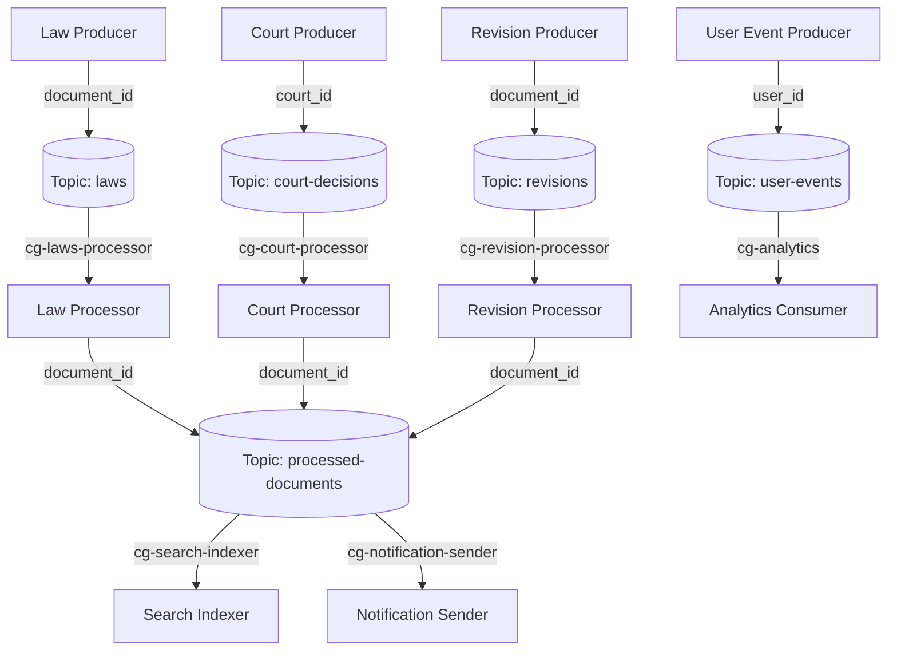

# Архитектура Kafka-пайплайна "Консультант Плюс"

## Схема потоков данных

## Описание топиков

### 1. Топик `laws` (Законы)
- **Назначение**: Поток новых и обновленных законов.
- **Партиции**: 3
- **Ключ**: `document_id` (строка). Законы с одним ID всегда попадают в одну партицию, что гарантирует порядок их обработки.
- **Политика хранения**: `delete`
- **Retention**: 30 дней. Законы важны, но после обработки они сохраняются в БД/индексе, поэтому вечно хранить их в Kafka нет смысла.
- **Гарантии доставки**: `acks=all` (At least once). Потеря закона недопустима.

### 2. Топик `court-decisions` (Судебные решения)
- **Назначение**: Поток судебных решений.
- **Партиции**: 6. Судебных решений значительно больше, чем законов, поэтому требуется большая пропускная способность и параллелизм.
- **Ключ**: `court_id` (строка). Решения одного суда обрабатываются последовательно.
- **Политика хранения**: `delete`
- **Retention**: 14 дней. Объем данных большой, храним меньше времени.
- **Гарантии доставки**: `acks=all` (At least once).

### 3. Топик `revisions` (Редакции документов)
- **Назначение**: Поток изменений (редакций) существующих документов.
- **Партиции**: 3
- **Ключ**: `document_id` (строка). Гарантирует, что редакции одного документа будут обработаны строго по порядку.
- **Политика хранения**: `compact`. Нам всегда нужна последняя актуальная редакция документа. Старые редакции могут удаляться (сжиматься).
- **Гарантии доставки**: `acks=all` (At least once).

### 4. Топик `processed-documents` (Обработанные документы)
- **Назначение**: Единый поток всех документов после их обработки (тегирования, нормализации) для дальнейшего потребления различными сервисами.
- **Партиции**: 6. Высокая нагрузка, так как сюда пишут 3 разных процессора.
- **Ключ**: `document_id` (строка).
- **Политика хранения**: `compact`. Потребителям (например, новому индексу) всегда нужна последняя версия обработанного документа.

### 5. Топик `user-events` (Пользовательские события)
- **Назначение**: Поток кликстрима, просмотров, поисковых запросов пользователей.
- **Партиции**: 3
- **Ключ**: `user_id` (строка). События одного пользователя обрабатываются по порядку.
- **Политика хранения**: `delete`
- **Retention**: 7 дней. События быстро устаревают, агрегируются и сохраняются в DWH.
- **Гарантии доставки**: `acks=1` (At most once). Потеря одного клика не критична для системы, важна скорость записи.

## Группы потребителей (Consumer Groups)

1. **Процессоры (Processors)**:
   - `cg-laws-processor` — читает `laws`, обогащает данные, пишет в `processed-documents`.
   - `cg-court-processor` — читает `court-decisions`, обогащает данные, пишет в `processed-documents`.
   - `cg-revision-processor` — читает `revisions`, обогащает данные, пишет в `processed-documents`.

2. **Потребители обработанных данных (Fan-out паттерн)**:
   - `cg-search-indexer` — читает `processed-documents` и обновляет поисковый индекс (Elasticsearch/OpenSearch).
   - `cg-notification-sender` — читает `processed-documents` (независимо от индексера) и рассылает push/email уведомления подписчикам.
   *Использование разных Consumer Group позволяет реализовать паттерн Fan-out: каждое сообщение будет прочитано обоими сервисами.*

3. **Аналитика**:
   - `cg-analytics` — читает `user-events` для подсчета статистики (например, топ популярных документов).
